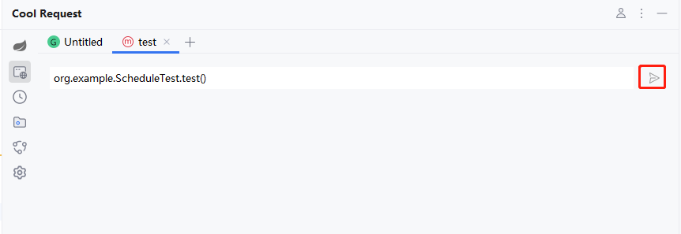
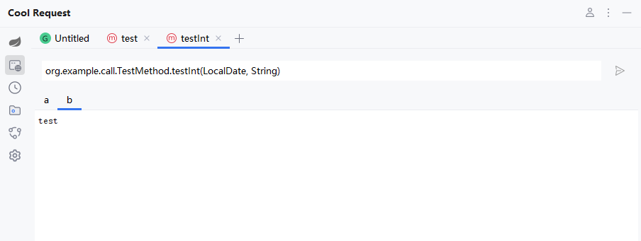
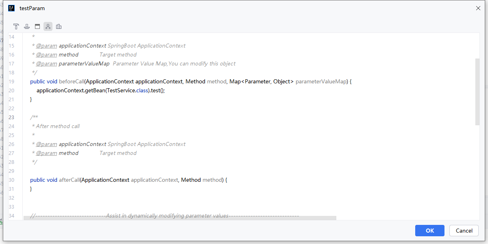

Cool Request支持在SpringBoot运行时调用任意容器内实例的方法、同时也包括静态方法。

##  使用方法

在想要调用的方法体内右击，选择CoolRequest->Call this Method

接着点击运行按钮即可。

当然，Cool Request支持大量常见的参数传递

### 前后置脚本

如果想在调用前/后执行自定义代码，如想更改某个对象属性，可编写脚本。

