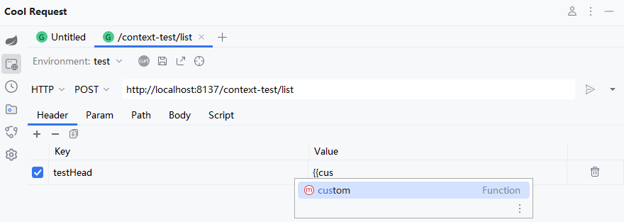
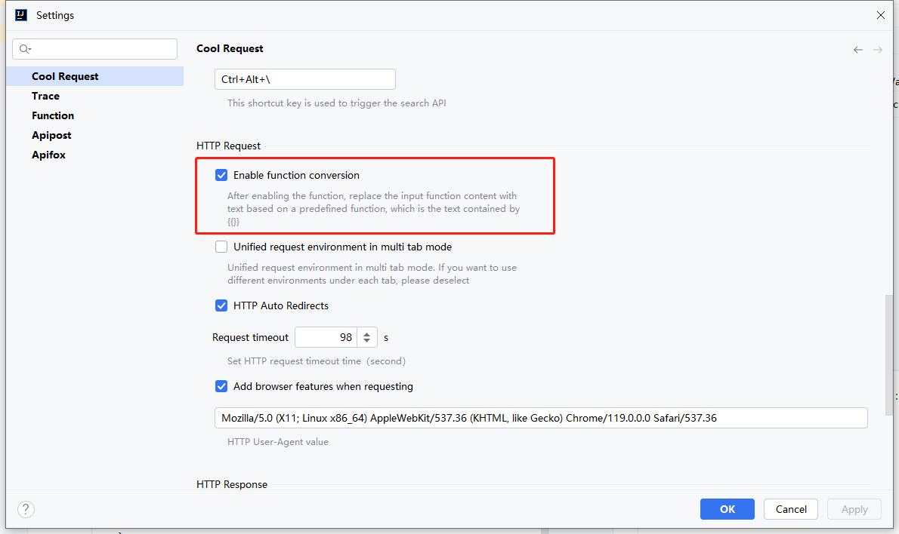

# 自定义函数

Cool Request拥有最强大得函数支持系统，当HTTP参数想要使用动态参数时，可根据自己需求，编写自定义函数。

函数可使用在任意HTTP参数中，包括请求头、URL参数、Path变量、请求体中。


例如想要增加一个自定义函数，可编译以下代码。
```java
public String custom(){
    return "custom";
}
```

在任意HTTP参数值中，通过`{{函数名}}`来引用此函数。




# 关闭函数转换

如果想关闭函数转换，可以设置中禁用


