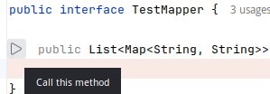
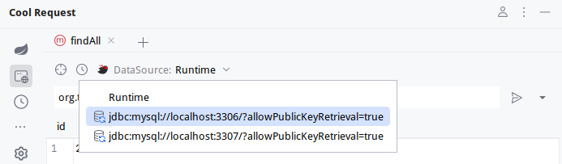

Cool Request支持在不启动SpringBoot程序时，执行Mybatis Mapper方法

##  使用方法

1. 在想要执行的Mapper方法上右击，选择CoolRequest->Call this Method，或将鼠标移动到方法左侧，点击快速运行按钮

    

2. 选择数据源

    

3. 点击运行按钮即可看到SQL的执行结果

## 设置数据源

Cool Request将在全局扫描以下文件查找数据源。

1. 所有yaml | yml结尾的文件，其内容包含以下配置
```yml
spring:
  datasource:
    url: jdbc:mysql://localhost:3307/?allowPublicKeyRetrieval=true
    username: root
    password: 123456
    driver-class-name: com.mysql.cj.jdbc.Driver
```
2. 所有properties结尾的文件，其内容包含以下配置

```properties
spring.datasource.url=jdbc:mysql://localhost:3306/?allowPublicKeyRetrieval=true
spring.datasource.username=root
spring.datasource.password=123456
spring.datasource.driver-class-name=com.mysql.cj.jdbc.Driver
```

:::danger 提示
暂时不支持lombok注解
:::