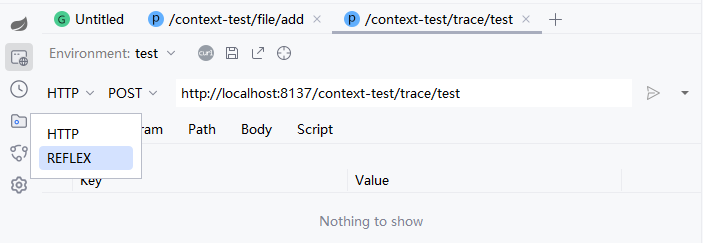

# 什么反射请求

发射请求可绕过系统中的拦截器，在开发时，可直接使请求进入到Controller方法。

普通HTTP请求的流程如下：
1. 构造HTTP参数
2. 发起HTTP请求
3. 进入Web容器
4. 进入过滤器
5. 进入拦截器
6. 进入Controller

而反射请求可以跳过其中的第3、第4步骤，而第5步是可选的，反射的流程如下：
1. 构造HTTP参数
2. 发起HTTP请求
3. 进入拦截器（可选择是否应用拦截器）
4. 进入Controller

进入参数配置界面，在左侧下拉框选中如下所示：

点击右侧  按钮即可发起反射请求。

:::danger 警告
反射请求不支持过滤器，会忽略，常见的一些安全框架认证依赖过滤器，这样会导致获取不到用户信息，此场景用于一些不依赖用户信息的请求。
:::