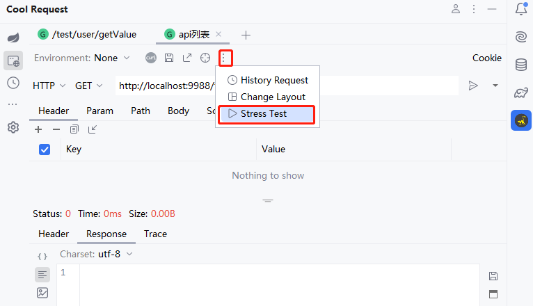
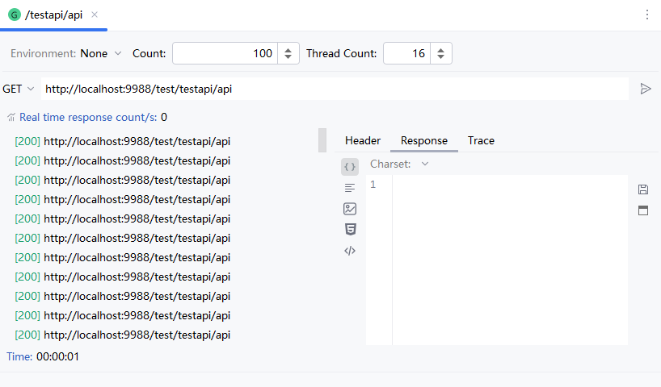

# 简介

压力测试提供了简单的并发请求，可选择调用次数以及线程数，暂无指标分析。

# 使用方法

选择一个将要进行压力测试的API，在更多选项中选择Stress Test

在新创建的Tab中填写调用次数、线程数，点击发送按钮即可。

如果想更改请求参数，在原参数面板中更改即可，如果原参数面板被关闭，相关联的压力测试面板也将不可用。

:::danger 警告
此功能较为耗内存，推荐修改IDEA启动的JVM参数，选择Help->Edit Custom VM Options，将-Xmx得值改为一个较大值，根据用户内存来定。
:::