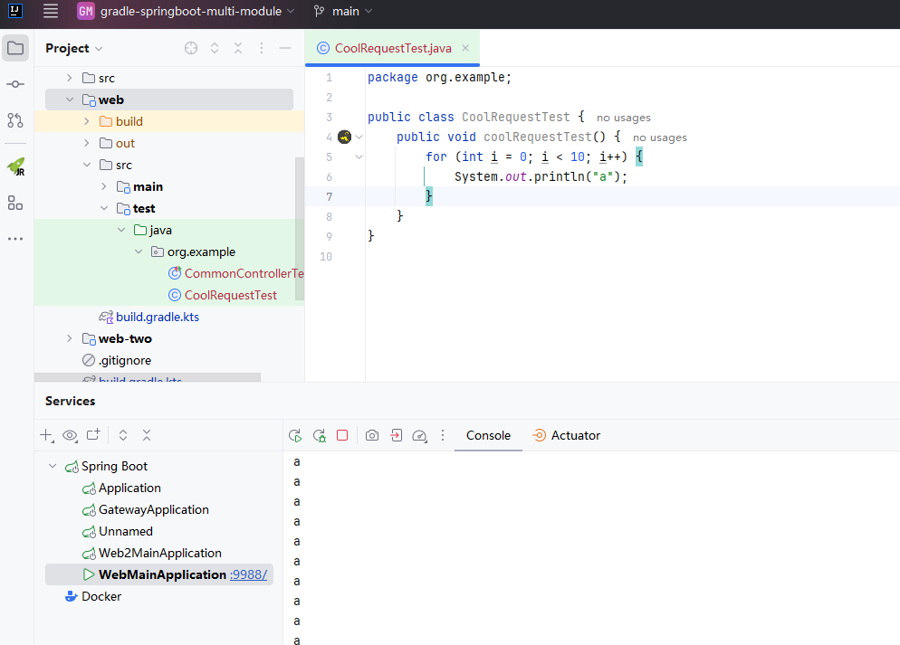

# 简介


快速测试代码基于正在运行的SpringBoot程序，将当前代码自动编译后注入到SpringBoot程序中，使代码快速生效，从而无需启动SpringBoot。

此功能同时支持依赖注入。

# 使用方式

在`test`模块下创建一个class，并编写一个以`coolRequest开头`的方法，如果此方法符合规范，左侧将会显示一个快速触发图标，点击快速图标后，如果当前有SpringBoot运行的实例，会将此代码注入到此实例中，如果有多个SpringBoot运行实例，可在弹出菜单中选择SpringBoot Main class。


## 依赖注入

 1. 通过Spring原生注解注入
 ```java
 public class CoolRequestTest {
    @Autowired
    private TestService testService;

    public void coolRequestTest() {
        testService.test();
    }
} 
 ```
 2. 通过参数注入
 ```java
 public class CoolRequestTest {

    public void coolRequestTest(TestService testService) {
        testService.test();
    }
}
 
 ```