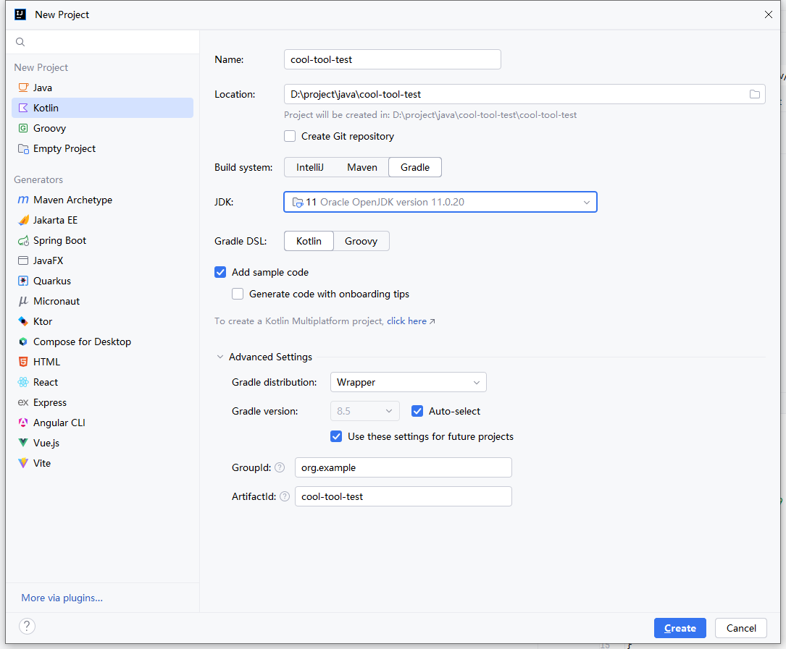
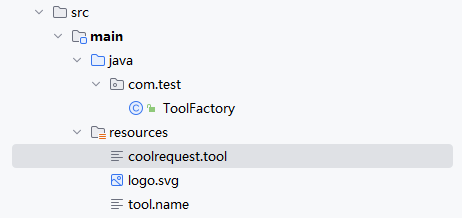
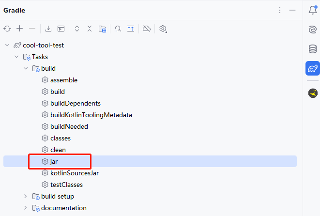
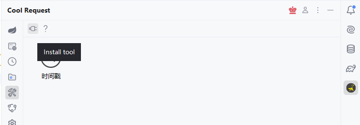
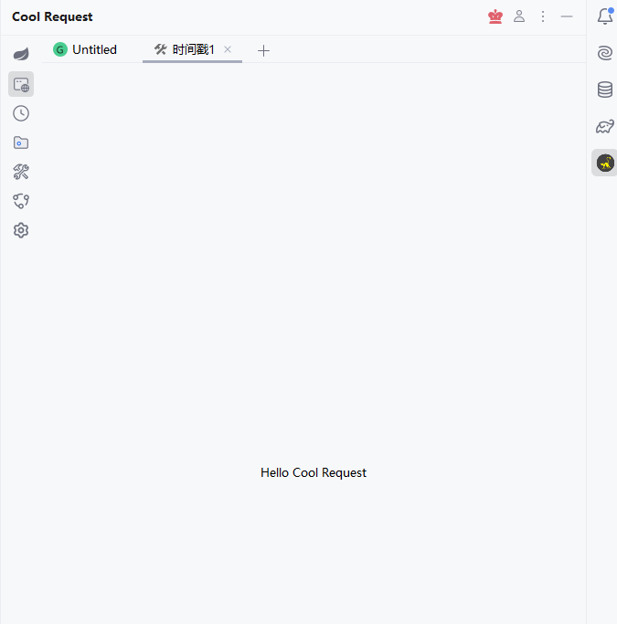

# 介绍

Cool Request在v2024.7.15中增加了小工具，并且广大用户可自行开发小工具，同时可安装官方所提供的工具库。

开发小工具所需知识如下。
1. Java、kotlin语言
2. Swing知识

小工具可打包成jar文件后，安装到Cool Request中使用。

# 开发所需依赖

[点击这里下载依赖](https://www.houxinlin.com/static/coolrequest-tool.jar)

## 开发步骤

1. 创建一个Java项目，推荐使用Gradle作为构建工具，JDK版本推荐使用jdk11，如果JDK过高，则可能无法加载小工具。

  

2. 修改配置文件

打开`build.gradle.kts`文件，增加如下配置。
```java
plugins {
    kotlin("jvm") version "1.9.23"
}

group = "org.example"
version = "1.0-SNAPSHOT"

repositories {
    mavenCentral()
}

dependencies {
    testImplementation(kotlin("test"))
    //引入下载的依赖
    implementation(files("D:\\project\\java\\coolrequest-tool\\coolrequest-tool.jar"))
}
//此配置用于将第三方依赖同项目打包成jar
tasks.withType<Jar> {
    from({
        configurations.runtimeClasspath.get().filter { it.name.endsWith("jar") }.map { zipTree(it) }
    })
}
tasks.test {
    useJUnitPlatform()
}
kotlin {
    jvmToolchain(11)
}

```
2. 编写主入口
```java
package com.test;

import dev.coolrequest.tool.CoolToolPanel;
import dev.coolrequest.tool.ToolPanelFactory;

import javax.swing.*;
import java.awt.*;

public class ToolFactory implements ToolPanelFactory {
    @Override
    public CoolToolPanel createToolPanel() {
        return new CoolToolPanel() {
            @Override
            public JPanel createPanel() {
                return new MainPanel();
            }

            @Override
            public void showTool() {

            }

            @Override
            public void closeTool() {

            }
        };
    }

    public static class MainPanel extends JPanel {
        public MainPanel() {
            setLayout(new BorderLayout());
            add(new JLabel("Hello Cool Request",SwingConstants.CENTER), BorderLayout.CENTER);
        }
    }
}


```

3. 增加配置文件

    在resources目录下创建三个文件，`coolrequest.tool`、`logo.svg`、`tool.name`
    1. `coolrequest.tool`

        保存实现ToolPanelFactory的类，用于告诉Cool Request从此类加载内容
    2.  `logo.svg`

        小工具图标，只能是svg格式，大小推荐在48*48。
    3. `tool.name`

        小工具名字

    


4. 打包项目

    打开Gradle控制面板，执行jar任务，最终的输出结果位于build/libs目录下。

    

## 安装小工具

    在Cool Request中打开工具面板，点击安装，即可安装小工具。
    

    双击即可使用小工具

    