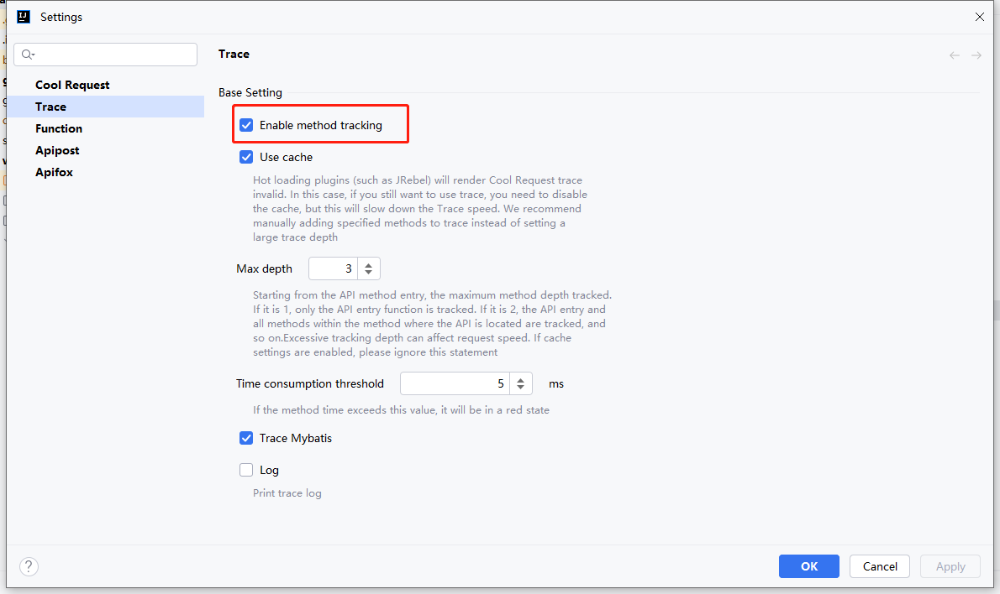

# 简介

Cool Request可以追踪任意方法(除java包外)，将自动根据API入口函数向下推测所有方法，并统计各个方法的耗时。

# 开启耗时追踪

Cool Request默认关闭方法耗时追踪，如果开启后，会影响第一次发起API时的速度，如果不需要耗时追踪，可点击关闭

# 发起追踪

当正常发起HTTP请求时，Cool Request将分析一次目标方法，根据设置的最大深度，尽可能多的追踪方法，这需要花费一些时间，且视所设置最大深度为定。

自动分析时，如果遇到了对interface形式的调用，则无法分析impl实现的方法，不会统计该方法，解决办法是改用注入impl的类，而不是service，或者使用`添加/取消自定义`方法手动添加impl方法。

# 添加/取消自定义方法

如果自动分析无法满足需求，可在任意方法体内右击，选择`Cool Request -> Add/Cancel Method To Trace`，添加/取消目标方法。

# 失效情况

有些原因可能会导致跟踪失效

1. 当Controller内部抛出异常时，Trace将失效，请确保链路中无异常,并且是从Controller方法中return;
2. 非SpringBoot项目
3. 使用了jrebel启动(理论支持，但如果失效，可正常启动重新尝试)
4. 确保HTTP返回状态返回200

如果发现为0 trace时，可重启一次IDEA再次尝试
