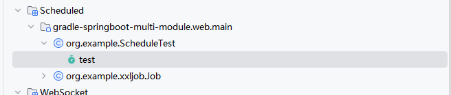
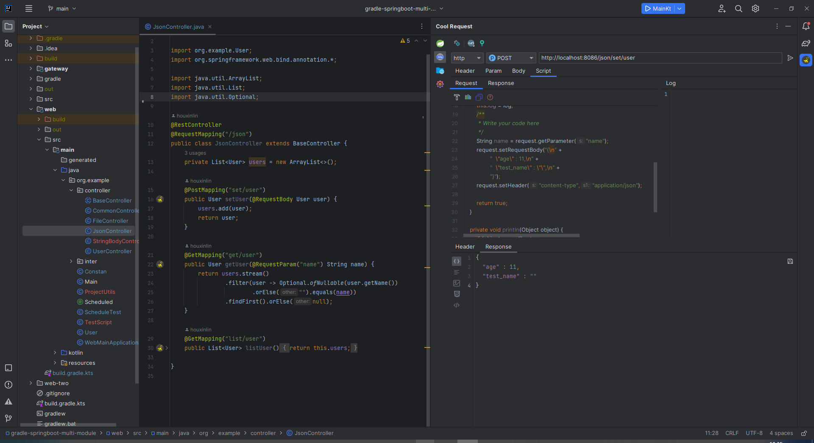
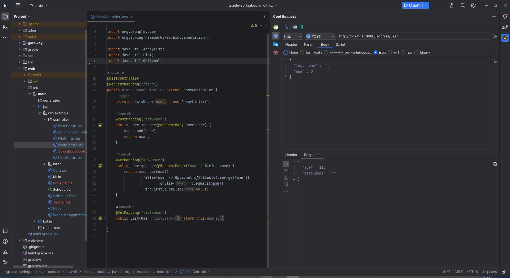
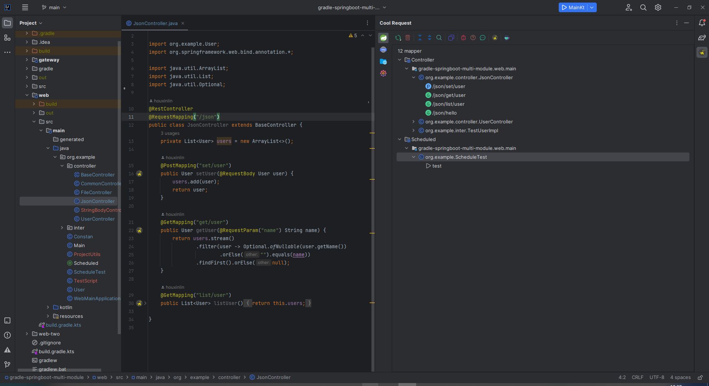

# 什么是Cool Request

Cool Request是一款基于 IntelliJ IDEA 的插件，旨在简化 Spring MVC(Boot) 项目中 API调试调用，提供了强大的参数推测能力、方法耗时追踪、运行时反射调用等能力。

:::tip
无力维护多个版本的文档，所有的文档针对最新版本
:::

# 功能介绍

  
汇总Spring MVC中定义的所有Controller信息，同时支持**HTTP/反射** 调用

  Cool Request会收集所有项目中所有HTTP的信息，通过汇总后展示，用户可通过UI点击将要调试的API，进行参数填写后发起HTTP请求。与此同时，Cool Request提供了一种运行时反射调用能力，
  可以在发起请求后直接进入目标方法，且不通过创建正真的HTTP请求，在此过程中，用户可配置是否将绕过拦截器，如果选择是，将不触发拦截器代码从而直接进入Controller方法。
  另外，可以指定**代理/原**对象，如果选择原对象，那么如果此Controller具有AOP逻辑，那么同时会失效。

  

     

  
汇总SpringBoot中定义的定时器，可手动触发，无需等待到指定时间

  Cool Request提供了一种手动触发具有 @Scheduled 注解方法的能力，无论定时器设置的间隔是多久，可在列表中选中对应的信息，手动触发。
  

 
 

  
一键导出为openapi格式

    Cool Request提供了将API导出为openapi的能力，可将导出的openapi在其他平台导入。

  
一键导入到apifox

    Cool Request接入了apifox的第三平台API，在设置中进行参数填写后，右击将要导出的API，可导出到apifox中，且支持目录选择。
      

  
复制请求为curl

    右击将要生成的API，可选择复制为curl格式，支持选择IP，此功能生成的参数信息是用户最后一次发起请求后所填写的参数。
    

 
 

  
强大HTTP请求参数推测，减少开发人员填写key的时间

    通过大量的检测逻辑，推算出API方法中所需要的参数，支持推测url参数、header参数、json参数、form表单参数。

  
使用java语法处理请求**前置/后置**脚本

    Cool Request提供了极为方便的java脚本，可以在请求前/后执行相关代码，同时可支持请求参数修改，为一些动态参数提供了极大的便利。
    

 
 

  
保存响应结果到文件

    在HTTP响应后，可一键保存响应结果，支持推测image、json、text等格式

 

  
json、xml、img、html、text响应快速预览

    可选择预览五种不同响应格式的数据，方便开发人员查看数据。
    

  
创建静态资源服务器

    Cool Request可以在5秒内配置一个静态资源服务器，可使用他进行文件下载，局域网内数据传输。

# 预览
  
  
  
  
  

# 如何安装
## 方法一

[点击这里](https://plugins.jetbrains.com/plugin/download?rel=true&updateId=503073)进行离线包下载。
:::tip
选择 FIle > Setting > Plugins > Install Plugin From Disk
:::

## 方式二
:::tip
选择 FIle > Setting > Plugins > 搜索Cool Request
:::
