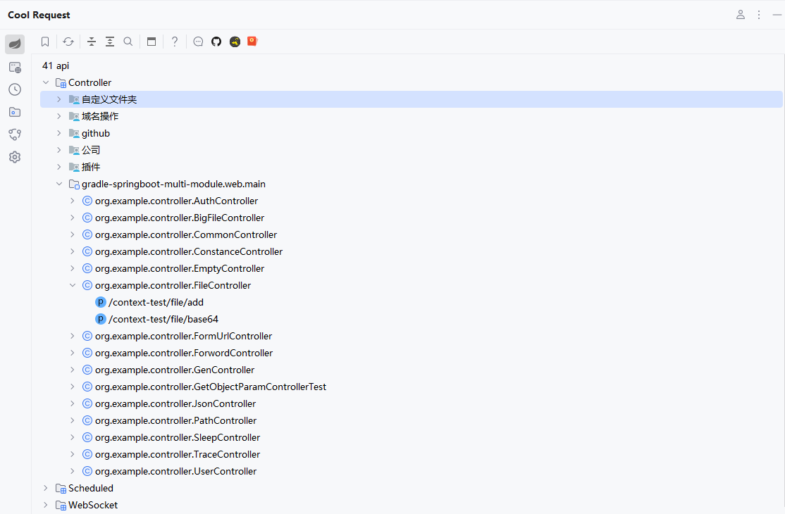
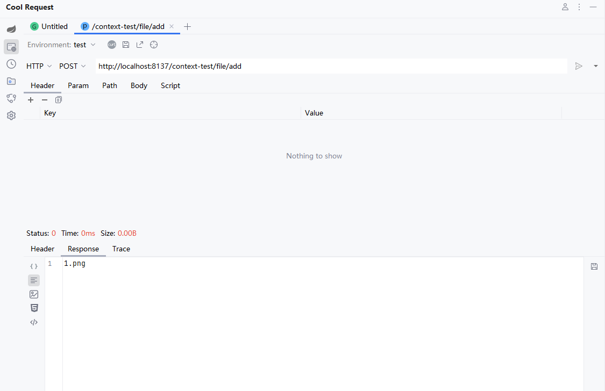
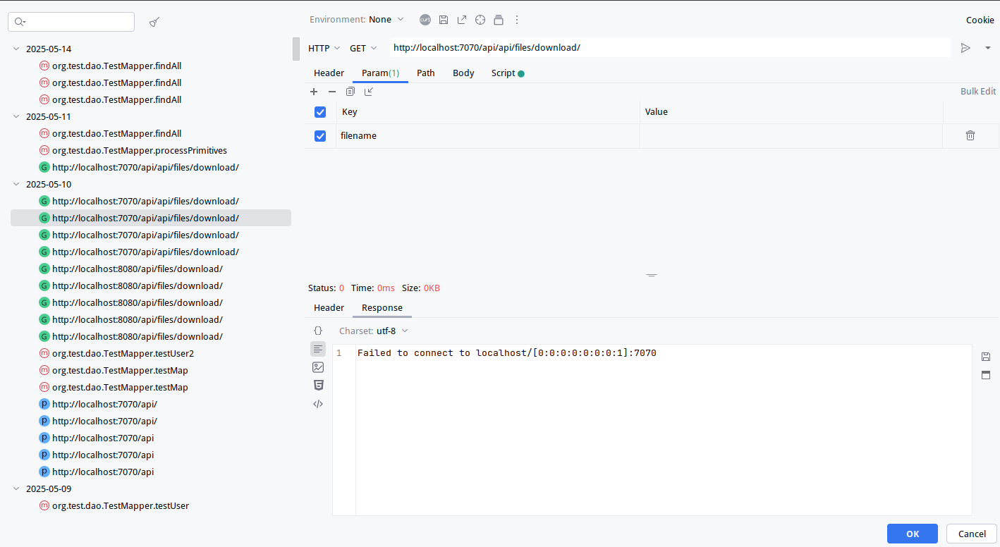

# 什么是Cool Request

:::tip
无力维护多个版本的文档，所有的文档针对最新版本
:::

Cool Request是一款基于 IntelliJ IDEA 的插件，旨在简化 Spring MVC(Boot) 项目中 API调试调用，提供了强大的参数推测能力、方法耗时追踪、运行时反射调用等能力。

# 预览
  
  
  

# 如何安装
## 方法一

[点击这里](https://plugins.jetbrains.com/plugin/download?rel=true&updateId=503073)进行离线包下载。
:::tip
选择 FIle > Setting > Plugins > Install Plugin From Disk
:::

## 方式二
:::tip
选择 FIle > Setting > Plugins > 搜索Cool Request
:::
