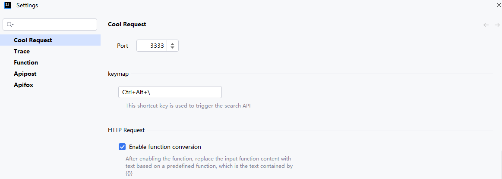

如果想通过某个API路径来搜索对应的Controller，有以下两种方法可唤起搜索界面。

1. 点击顶部搜索图标
    
    

2. 快捷键    
    Windows/Linux：Ctrl+Shift+N
    
    Mac: Cmd + Shift + O

    选中`<Cool Request>`页来进行API搜索

    

3. 专属快捷键
    默认为Ctrl+Shift+S    

    可在设置中进行更改

    