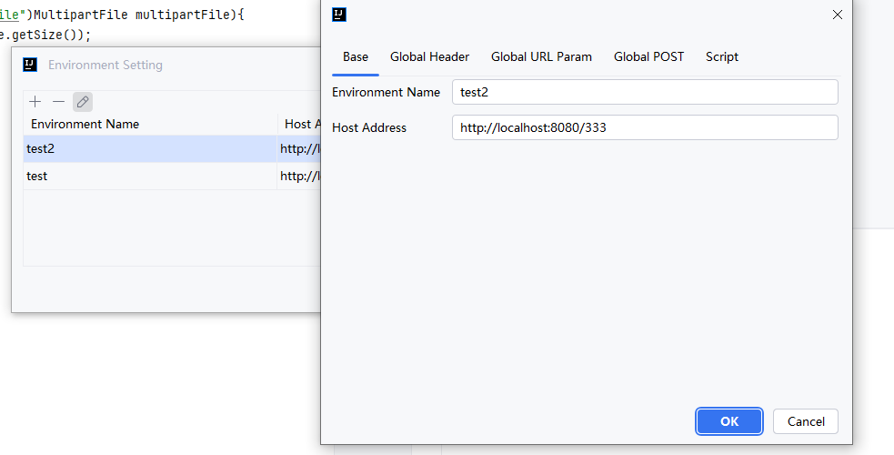

Cool Request提供了环境配置，可以配置不同参数、如URL主机、全局参数、全局请求头、全局x-www-form-urlencoded、全局form-data。

:::tip
默认环境为None，此环境无法配置全局参数，用户可手动增加新的环境配置，None环境只会推测`server.port`和`server.servlet.context-path`，如果用户通过启动参数配置，Cool Request任然可以检测到。
:::

# 配置新的环境变量

点击＋号，输入环境名称、主机路径，点击"OK"即可增加新的环境，用户可通过不同环境，自行增加全局参数。

