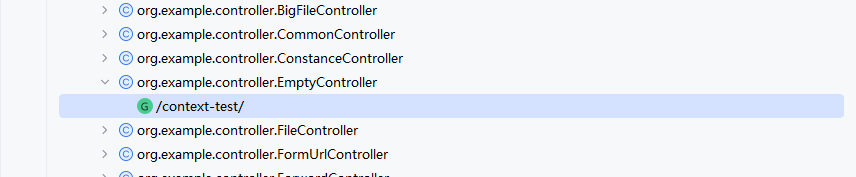
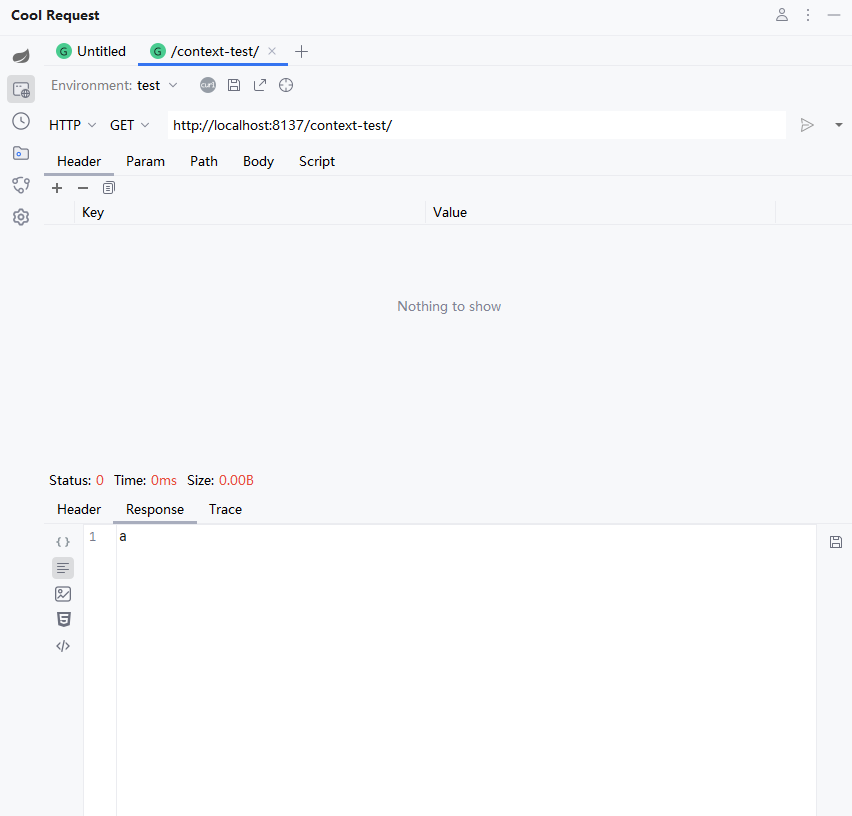

当扫描API成功后，双击将要调试的API。

会自动跳转到HTTP请求界面。
:::tip
 HTTP请求界面分为上下两个布局，第一个为HTTP参数设置界面，第二个为HTTP响应预览界面。
:::

点击右侧  按钮即可发起HTTP请求。

:::tip
HTTP发起后，Cool Request会保存当前参数，下次调试时，会复用上次的参数配置，同时会预览上次的响应结果。
:::

:::danger 警告
 当参数被修改，如果未发起HTTP请求，且跳转到其他Controller，那么不会保留任何数据，包括脚本。
:::