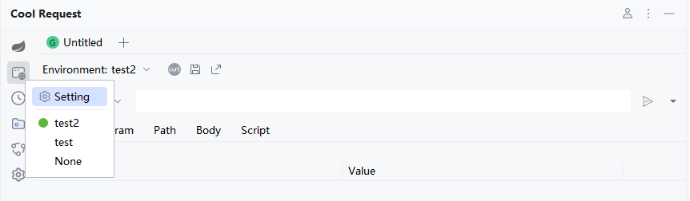

# Spring网关

Cool Request在网关程序启动后，会自动提取网关配置的路劲，并添加到环境变量中，用户只需要根据实际修改配置即可。

例如有以下代码：

```java
@Configuration
public class Config {
    @Bean
    public RouteLocator customRouteLocator(RouteLocatorBuilder builder) {
        return builder.routes()
                .route("api_route", r -> r.path("/api/**")
                        .filters(f -> f.stripPrefix(1))
                        .uri("http://localhost:8080"))
                .build();
    }
}

```



:::tip
此过程必须重启网关程序，如果启动后未发现自动添加到环境变量中，可手动添加。
:::