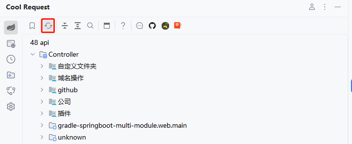
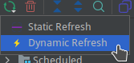

# 扫描API

Cool Request提供了两种扫描项目API方式，Static和Dyanmic。

1. Static

    Static扫描会尽可能多的扫描出API，但不会扫描第三方库中的数据，在IDEA 建立索引完成后自动触发一次Static扫描。

    

    :::tip
        Static扫描支持获取项目中定义的`server.port`和`server.servlet.context-path`，如果没有指定，则默认为`8080`和`/`,同时支持`spring.profiles.active`检测。

    :::

1. Dynamic

   Dynamic仅在项目启动后有效，原理是从SpringBoot容器中获取数据，此方法获取的数据最全，当扫描成功后，每个API列表前会出现图标，**只有具有此图标的API才可以进行反射调用。**

   

      
    :::tip
    动态扫描支持`--server.port`和`--server.servlet.context-path`启动参数，如果项目的`port`和`context-path`以此方式启动，则需要使用Dynamic扫描技术，这样在API调试时，会自动生成当前参数的Host信息。