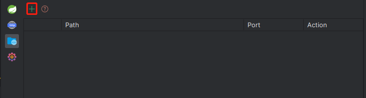
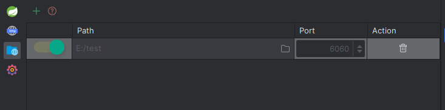
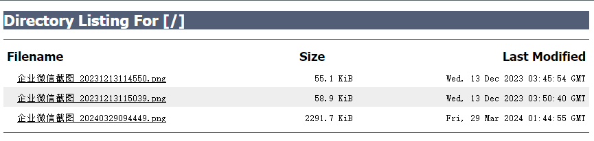

# 创建静态服务

Cool Request可以创建一个静态资源服务器，可方便对本机数据进行共享，操作方式如下：
1. 进入静态服务器页面，点击＋号。

2. 点击要共享的文件夹，选择监听的端口后，并点击左侧开关按钮，即可开启静态web服务。

3. 访问浏览器，输入对应文件名，即可下载/预览相关联的文件。

:::tip
当删除一个运行中的web服务时，web服务器也会自动停止。
:::
