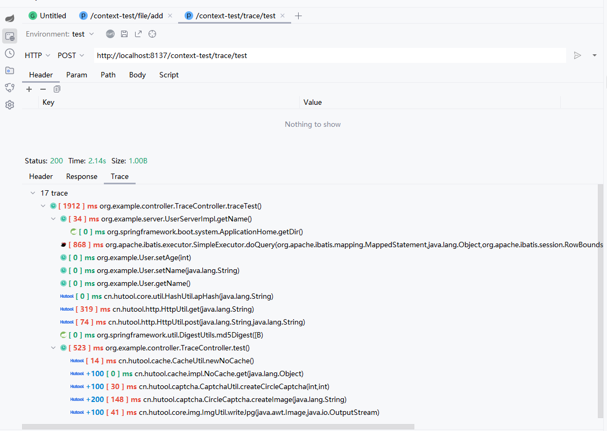

# 简介

Cool Request可以追踪任意方法(除java包外)，将自动根据API入口函数向下推测所有方法，并统计各个方法的耗时。

# 开启耗时追踪

Cool Request默认关闭方法耗时追踪，如果开启后，会影响第一次发起API时的速度，如果不需要耗时追踪，可点击关闭

# 发起追踪

当正常发起HTTP请求时，Cool Request将分析一次目标方法，根据设置的最大深度，尽可能多的追踪方法，这需要花费一些时间，且视所设置最大深度为定。

# 添加/取消自定义方法

如果自动分析无法满足需求，可在任意方法体内右击，选择`Cool Request -> Add/Cancel Method To Trace`，添加/取消目标方法。

