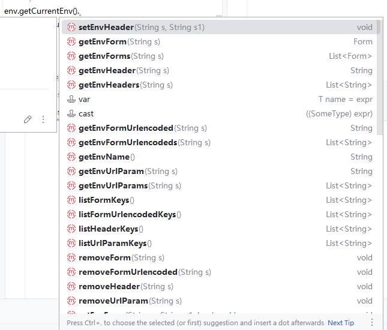

#  通用函数

# ILog

ILog用于在脚本中日志输出。
:::danger 警告
这是唯一的方式，无法使用System.out.println进行输出。
:::

## log.println
输出日志并换行。
```
log.println("log");
```

## log.print
输出日志(无换行)。
```
log.print("log");
```

# IEnv

IEnv对象用于操作环境中的数据，可通过脚本增加、删除、修改环境中的数据。

## getCurrentEnv
获取当前请求使用的环境对象。

```
env.getCurrentEnv()
```

## getEnvByName
根据环境名称获取环境对象。

```
env.getEnvByName("dev")
```

# Env对象

Env对象代表环境，可调用诸多方法对环境进行操作


