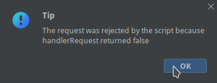

#  前置脚本

前置脚本用于在请求发起前执行用户代码，可对请求参数进行修改，用户代码需要编写在`handlerRequest`函数下。
```java
public boolean handlerRequest(ILog log, HTTPRequest request) {

      return true;
}
```

handlerRequest返回值表示是否可以发起HTTP请求，当为`true`表示可以发起，`false`时将取消发起，并会提示以下信息。




:::danger 警告
    不得修改方法名、返回值、参数列表和所在的类名、这会导致编译失败。
:::

## HTTPRequest


### request.setParameter(String,String)
设置Url请求参数。
```java title="示例"
request.setParameter("page","2");
```


### request.getParameterMap()
获取请求参数Map(此方法仅获取URL中的参数，无法获取Body的的参数)。
```java title="示例"
Map<String, List<String>> parameterMap = request.getParameterMap();
for (String key : parameterMap.keySet()) {
    log.println(key);
}

```


### request.getParameter(String)
获取请求参数，如果存在多个则返回第一个(此方法仅获取URL中的参数，无法获取Body的的参数)。
```java title="示例"
String value =request.getParameter("name");
```


### request.getParameterValues()
获取请求参数中指定key参数的所有值(此方法仅获取URL中的参数，无法获取Body的的参数)。
```java title="示例"
 List<String> name = request.getParameterValues("name");
 for (String s : name) {
     log.println(s);
 }
```


### request.getHeader(String)
获取HTTP请求头。
```java title="示例"
String values =request.getHeader("key");
```


### request.setHeader(String,String)
设置HTTP请求头。
```java title="示例"
request.setHeader("name","zhangsan");
```


### request.addHeader(String,String)
添加HTTP请求头。
```java title="示例"
request.addHeader("name","zhangsan");
```


### response.getHeaderKeys()
获取所有请求头的key列表，返回`List<String>`。
```java title="示例"
List<String> keys =response.getHeaderKeys();
for (String headerKey : keys) {
    println(headerKey);            
}
```


### request.getUrl()
获取请求Url地址
```java title="示例"
String url =request.getUrl();
```


### request.setUrl(String)
设置新的url地址。
```java title="示例"
request.setUrl("http://localhost:8080/name?age=1");
```


### request.getRequestBody()
仅当非GET请求时有数据，获取请求体。
```java title="示例"
byte[] body =request.getRequestBody();
```


### request.setRequestBody(String)
设置请求体。
```java title="示例"
request.setRequestBody("name=zhangsan");
```