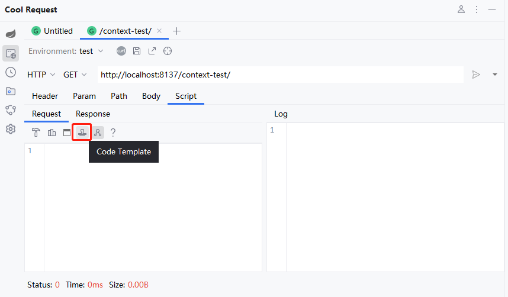
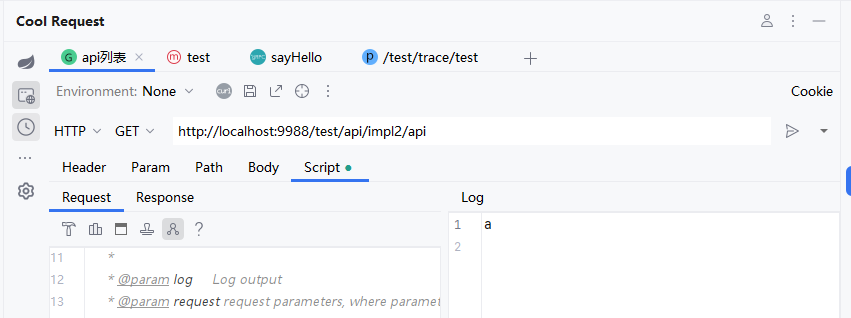

# 介绍

Cool Request提供了脚本，可以使用Java语法在请求前修改HTTP请求参数，或者是响应后进行一系列操作，对于那些需要动态参数的请求来说，这是非常有用的。

在脚本中，可以调用项目依赖的第三方库（比如Spring自带的Util库），也可以是项目本身的Class，注意，内置编译器跟随IDEA版本，可能会导致低版本IDEA无法调用高版本的class。

对应环境如下：
| IDEA版本      | JDK |
| ----------- | ----------- |
| 2022.2+      | 17       |
| 2024.2+    | 21        |


# 插入模板
点击下方按钮，可以插入默认代码模板。



:::danger 警告
由于Java自身原因，当使用脚本后，发起请求速度会变慢。
:::

# 代码高亮

当编写脚本时，会发现`HTTPRequest`和`ILog`报红现象，这是因为项目没有找到这个依赖所导致，可通过点击如图中所示按钮，进行安装。


# 调用第三方库

默认会启用第三方库支持，但是会影响执行速度，如果脚本中不需要使用第三方库，可点击下方按钮选择禁用。




```java  title="调用DigestUtils进行加密"
public boolean handlerRequest(ILog log, HTTPRequest request,IEnv env) {

    String userName = request.getParameter("userName");
    String md5 = org.springframework.util.DigestUtils.md5DigestAsHex(("abc" + userName).getBytes());
    request.setParameter("userName", md5);

    return true;
}

```

```java  title="调用项目类"
public boolean handlerRequest(ILog log, HTTPRequest request) {
    log.println(ProjectUtils.getValue());
    return true;
}
```

:::danger 警告
项目类必须被编译后才可以调用，否则会出现"找不到类"情况，并且项目使用的JDK不得大于IDEA使用的JDK版本号。
:::