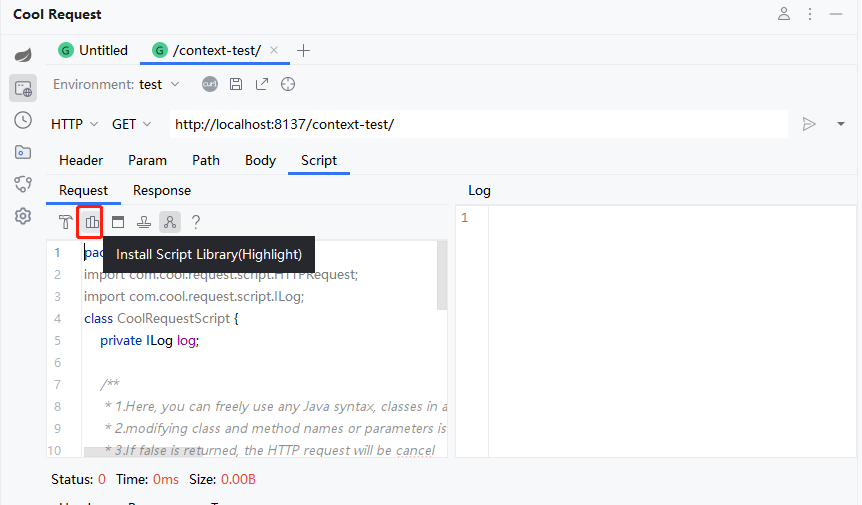

# 介绍

Cool Request提供了脚本，可以使用Java语法在请求前修改请求，或者是响应后进行一系列操作，对于那些需要动态参数的请求来说，这是非常有用的。

另一个值得兴奋的是，在脚本中，可以调用项目依赖第三方库（比如Spring自带的Util库），也可以是项目本身的Class，但是由于内置的编译器是JDK8，所以，当调用的第三方库Java版本超过8时，将会出现异常。


# 引入依赖

当编写脚本时，会发现`HTTPRequest`和`ILog`报红现象，这是因为项目没有找到这个依赖所导致，可通过点击如图中所示按钮，进行安装。



# 调用第三方库
```java  title="调用DigestUtils进行加密"
public boolean handlerRequest(ILog log, HTTPRequest request) {

    String userName = request.getParameter("userName");
    String md5 = org.springframework.util.DigestUtils.md5DigestAsHex(("abc" + userName).getBytes());
    request.setParameter("userName", md5);

    return true;
}

```

```java  title="调用项目类"
public boolean handlerRequest(ILog log, HTTPRequest request) {
    log.println(ProjectUtils.getValue());
    return true;
}
```


:::danger 警告
项目类必须被编译后才可以调用，否则会出现"找不到类"情况，并且项目使用的JDK不得大于8，但这只是无法调用比JDK 8更高的API，在这种情况下，开发人员可以自行在脚本代码中编写所需代码。
:::