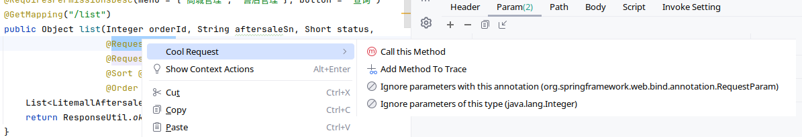

# v2025.4.25

1. 优化体验

# v2025.4.7

1. 历史记录中增加Call this method记录

2. 修复bug

# v2025.3.1

1. 增加JSON Tree预览（来源于Json Assistant插件）

2. 增加SSE

3. 增加存储测试用例

(可在空白处使用滑轮切换测试用例参数)

# v2025.2.1
1. 增加MySQL日志跟踪

2. 优化全局环境，可选择性勾选全局参数
3. 优化标签，重启IDEA后可恢复至上次状态
4. 增加参数文本模式编辑

5. 增加参数输入提示

6. HTTP参数推测时，可选择指定类型参数进行忽略

7. 增加Call this method 方法耗时跟踪

# v2024.12.1
1. 增加离线文档导出
2. 修复很多个bug

# v2024.11.15
1. 增加call this method快速按钮
2. 优化内网穿透
3. 修复bug
4. 多处UI细节优化

# v2024.11.1
1. 增加Run Collections
2. 优化测试推测能力
3. 增加public函数仓库、函数支持参数传递
4. 增加参数放大编辑
5. SpringBoot低版本兼容
6. 解决n多个Bug

# v2024.10.15
1. 增加gRPC调用
2. 增加压力测试
3. 支持form-data中填写json
4. 提升API扫描速度
5. 增加test模块下方法快速执行
6. 增加call this method前后置脚本
7. 优化部分功能体验 

# v2024.9.1
1. 优化cURL导入，支持分析Path参数
2. 支持Rose框架
3. 增加自定义搜索显示
4. 优化小工具卸载 
5. 调整左侧图标显示风格
6. 优化Trace时候自动对interface实现的跟踪
7. 当项目处于Debug时，HTTP将自动设置不超时
8. 识别在父类方法中编写的文档

# v2024.8.15
1. 优化方法调用
2. 增加参数导入
3. 优化响应体格式化
4. 增加url、path、cURL快速复制
5. 优化方法耗时跟踪
6. 增加自定义注解扫描(SpringMvc组合注解)

# v2024.8.1
1. 增加Cookie管理
2. 增加Trace方法参数查看
3. 增加Tab标签可浮动
4. 增加URL Post Processor，可自由生成url
5. 优化响应显示格式，自动格式化json、xml

# v2024.7.15
1. HTTP参数参数数量概要
2. 增加全局环境变量
3. 增加小工具
4. 可自定义显示/隐藏左侧工具面板
5. 优化多标签模式
6. 增加全选/反选HTTP参数
7. 方法调用优化
8. 增加响应预览自定义编码方式
9. 多标签模式下可拖动Tab

# v2024.7.1
1. 增加内网穿透、免费域名、免备案
2. 增加函数库，可自定义函数，通过`{{xx}}`使用函数
3. 修复已知bug

# v2024.6.15
1. 增加WebSocket测试
2. 增加对Spring容器内任意方法调用
3. 增加历史记录搜索
4. API列表可显示Java Doc注释
5. 增加HTTP请求重定向时自动附带Cookie
6. 优化UI体验

# v2024.6.1
1. 增加多标签模式
2. 增加历史记录
3. 优化API扫描
4. 修复已知bug

# v2024.5.1
1. 修复form表单格式bug
2. 新增表单之间数据一键转换
3. 增加url输入框高亮
4. 增加一键提取url输入框中参数到表格
5. 优化自定义api保存
6. 优化数据刷新
7. 优化自定义API保存体验
8. 优化UI体验
9. 增加自定义API文件夹导出

# v2024.4.15
1. 增加Swagger方法介绍
2. 修复静态资源服务器多窗口下数据不同步Bug
3. 兼容RequestMapping多method写法
4. 增加api搜索历史记录缓存
5. 增加全局脚本
6. 修复插件导致项目无法自动终止Bug
7. 修复匿名类扫描Bug
8. 增加自定义API配置概要
9. 增加只显示API概要选项

# v2024.4.1
1. 增加方法耗时跟踪，可添加/取消自定义方法
2. 增加脚本中对环境变量的操作
3. 增强了对反射调用、定时器、xxl_job的逻辑
4. 修改环境设置UI
5. 修复了N多个bug

# v2024.3.15
1. 增加api在代码标签中打开
2. 增加icon切换，可使用内置IDEA内置icon
4. 增加api搜索快捷键，默认为Ctrl+Shift+S
5. 新增xxl-job调度器的支持，可配置参数
6. 增加HTTP请求超时设置，和大数据响应限制
7. 增加HTTP状态显示，包括响应时间、响应大小、响应状态码
8. 优化参数推测
9. 支持apipost导出
10. 增加发送请求时候自动加入浏览器特征
